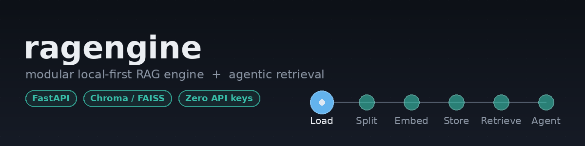

<p align="center">
  
</p>

<h1 align="center">ragengine</h1>

<p align="center">
  A modular, local-first <b>Retrieval-Augmented Generation (RAG) engine</b> with a REST API,
  five interchangeable retrieval strategies, and an optional <b>agentic RAG</b> mode where an
  LLM decides when and how to search instead of always retrieving once and stopping.
</p>

<p align="center">
  
  
  
</p>

---

Runs with **zero API keys and zero model downloads** out of the box (deterministic fake embeddings + a stub LLM), so you can clone it and see it work in under a minute. Swap in real local models (HuggingFace / Ollama) with one environment variable when you're ready.

```bash
git clone https://github.com/<your-username>/ragengine.git && cd ragengine
pip install -r requirements.txt && pip install -e .
uvicorn ragengine.api.main:app --reload
# -> http://localhost:8000/docs
```
or
```bash
docker compose up --build
```

```bash
curl -X POST localhost:8000/ingest/text -H 'content-type: application/json' \
  -d '{"text": "Full time employees get 20 days of paid vacation per year."}'

curl -X POST localhost:8000/query -H 'content-type: application/json' \
  -d '{"question": "How much vacation do I get?"}'
```

---

## What this is, and where it came from

This project grew out of six IBM Skills Network / LangChain course notebooks covering one underlying skill — building a retrieval pipeline — just at different stages: document loading, text splitting, embeddings, vector stores, and retrieval strategies. Rather than clean each notebook up individually, this reorganizes all of them into **one system**, with each notebook's techniques becoming a swappable implementation behind a shared interface, plus an **agentic RAG** layer on top (an LLM that decides whether/how to retrieve, rather than a fixed pipeline).

| Stage | Source notebook | What became pluggable here |
|---|---|---|
| Load | `LangChain_document_loader` | 7 loaders: text, PDF (pypdf/PyMuPDF), Markdown, JSON, CSV, web/HTML, docx |
| Split | `LangChain_text-splitter` | 5 splitters: character, recursive character, code (language-aware), markdown-header, HTML-header |
| Embed | `Embed_documents_with_watsonx's_embedding` | embedding backends: deterministic fake (default/tests) + sentence-transformers (real, local) |
| Store | `LangChain_vector_store` | Chroma + FAISS, both hand-wrapped (see "Deliberate departures" below) |
| Retrieve | `LangChain_retriever` | similarity / MMR / score-threshold / multi-query / parent-document / self-query |
| (motivation) | `Full_document_retrieve_limitation` | the reason retrieval-then-generate exists instead of stuffing whole documents into a prompt — see the agent's reformulation loop below for the same problem from another angle |

## Why it's organized this way

Every stage above is an ABC/Protocol with one file per implementation and a registry to look one up by name — `loaders/`, `splitters/`, `embeddings/`, `vectorstores/`, `retrievers/`. `RagPipeline` (`pipeline.py`) is the only place that wires them together, driven by `config.py` (env-var configurable, nothing hardcoded). Compared to a notebook, that buys:

- **Swappable, not copy-pasted** — switch vector store, embedding model, or retrieval strategy via config/request parameter, not by editing code.
- **Config instead of hardcoded constants** — chunk size, model names, backend choice all come from `Settings`/env vars.
- **A real API, not "run all cells"** — `POST /ingest`, `POST /query`, `POST /agent/query`.
- **107 automated tests**, run in a clean virtualenv against only `requirements.txt` (see "What's verified" below) — not "it looked right in the notebook output."
- **Docker + a documented local-model path**, instead of a notebook someone has to open in Jupyter with cloud credentials.

### Deliberate departures from the source notebooks

A few places do something different from the notebooks on purpose, documented in code where the decision actually lives:

- **Vector stores never hold an embedding function.** LangChain's `Chroma`/`FAISS` wrappers bundle one in; here, a `VectorStore` only ever deals in vectors it's handed, so vector-store CRUD (`tests/test_vectorstores.py`) is tested completely independently of embedding quality. See `vectorstores/base.py`.
- **JSON loading doesn't depend on `jq`.** LangChain's `JSONLoader` shells out to the `jq` C library — a common install failure point. A small in-house interpreter (`loaders/json_loader.py`) supports the same `.messages[].content`-style path syntax without that dependency.
- **FAISS and Chroma return identical, comparable similarity scores.** FAISS vectors are L2-normalized before indexing and Chroma is configured with `hnsw:space=cosine`, so switching backends doesn't silently change what "0.8 similarity" means. See `vectorstores/faiss_store.py`.
- **MMR re-embeds its candidate pool** rather than requiring vector stores to expose raw stored vectors (not every real vector DB makes bulk vector fetch easy) — a deliberate small-inefficiency-for-uniform-interface trade-off. See `retrievers/similarity.py`.

## The agentic RAG mode

`POST /query` always retrieves exactly once. `POST /agent/query` (`agent/orchestrator.py`) instead lets the LLM decide, per question:

1. Do I even need to search, or can I answer directly?
2. What should I search for?
3. Is what came back enough, or should I reformulate and search again? (bounded by `RAG_AGENT_MAX_ITERATIONS`, default 3)

The protocol is plain-text (`SEARCH: <query>` / `ANSWER: <answer>`) rather than JSON function-calling, so it works even with small local models that don't support structured tool calling. `SelfQueryRetriever` (`retrievers/self_query.py`) shows the JSON-structured-output style for the one case that specifically needs it (parsing a filter).

## Re-ranking

`RerankingRetriever` (`retrievers/reranking.py`, `retriever_name="rerank"`) wraps any other retriever in a two-stage retrieve-then-rerank pipeline: the base retriever cheaply widens a candidate pool (`RAG_RERANK_FETCH_K`, default 20) using vector similarity, then a `Reranker` (`rerankers/`) re-scores that pool by actually looking at query/document text pairs — the classic recall-then-precision split that makes cross-encoder-quality scoring affordable instead of running it over an entire corpus per query.

Two backends, same interface split as embeddings and LLMs:
- **`lexical_overlap`** (default) — dependency-free BM25 over the candidate pool. Not a stand-in for a real reranker; BM25 is a legitimate classical IR technique, so this is a genuine default, not only a test double.
- **`cross_encoder`** — a real local cross-encoder (`cross-encoder/ms-marco-MiniLM-L-6-v2` by default) via `sentence-transformers`, lazy-imported so it's never required unless selected: `export RAG_RERANKER_BACKEND=cross_encoder` (needs the `local-models` extra, see above).

## API

| Endpoint | Purpose |
|---|---|
| `GET /health` | backend status + index counts |
| `POST /ingest` | upload a file (txt/pdf/md/json/csv/docx/html) to index |
| `POST /ingest/text` | index raw text with no file |
| `POST /query` | one-shot retrieve + answer |
| `POST /agent/query` | agentic retrieve + answer (see above) |

Full interactive docs at `/docs` once running (FastAPI/Swagger, auto-generated from `api/schemas.py`).

`retriever_name` on `/query` and `/agent/query` accepts: `similarity` (default) | `mmr` | `similarity_score_threshold` | `multi_query` | `parent_document` | `self_query` | `rerank`.

## Configuration

Everything is an environment variable prefixed `RAG_` (see `.env.example` for the full list with defaults) or a field on `Settings` (`config.py`). Nothing is required — defaults are `fake` embeddings + `stub` LLM + in-memory Chroma.

To use real local models instead:
```bash
pip install -e ".[local-models]"    # pulls in torch + transformers + sentence-transformers
export RAG_EMBEDDING_BACKEND=sentence_transformers
export RAG_LLM_BACKEND=ollama       # requires `ollama serve` + `ollama pull llama3.2` separately
# or: RAG_LLM_BACKEND=huggingface  (no separate server, but heavier/slower)
```

## Running the tests

```bash
pip install -r requirements.txt pytest httpx
pip install --no-deps -e .
pytest
```

107 tests, ~3 seconds, no network access required.

## What's actually verified, and what isn't

Being direct about this rather than overselling it:

**Verified in this build**, including in a clean virtualenv built from nothing but `requirements.txt`:
- All 7 loaders, against real files (including a generated PDF and a generated .docx — see `tests/fixtures/`)
- All 5 splitters, including metadata propagation through chunking
- Both vector store backends — CRUD, similarity search, metadata filtering, and two real bugs this surfaced and fixed: Chroma silently invoking its own default embedding model if you update a document's text without also passing a new embedding, and Chroma rejecting `None` metadata values / empty metadata dicts outright (see `vectorstores/chroma_store.py`)
- All 6 retrievers, including MMR actually diversifying a near-duplicate result set (not just running without error), self-query actually applying an LLM-parsed metadata filter, and `RerankingRetriever` actually reordering results by lexical relevance rather than just first-pass vector score (not just running without error)
- `LexicalOverlapReranker`'s BM25 scoring directly — stronger term overlap scores higher, disjoint vocabulary scores zero, empty candidate pools handled
- The agent's search → evaluate → reformulate → answer loop, including the max-iterations-exhausted forced-answer path
- The full pipeline end-to-end (ingest → chunk → embed → store → retrieve → generate) on both Chroma and FAISS
- The full FastAPI layer via `TestClient`, including file upload, error responses, and `retriever_name="rerank"` end-to-end through `/query`
- A full round-trip: booted the API for real with `uvicorn` and exercised every endpoint with `curl`, and separately extracted a clean zip of the repo into a fresh virtualenv and re-ran the whole test suite from nothing but `requirements.txt`

**Not verified here, and why:**
- `SentenceTransformerEmbedding`, `HuggingFaceLocalLLM`, and `CrossEncoderReranker` — these need `huggingface.co` network access to download model weights, which the environment this was built in doesn't have. The code is structurally correct and the import is lazy (importing the package never requires `torch`), but the actual download-and-embed/download-and-score path hasn't been exercised. Try it locally: `pip install -e ".[local-models]"`.
- `OllamaLLM` — needs a running `ollama serve` process not available in that environment.
- The actual `docker build` — Docker itself wasn't available there either. The Dockerfile runs the same `pip install -r requirements.txt` + `pip install --no-deps -e .` steps verified directly in the clean virtualenv above, but the image itself was never built.
- `WebLoader.load()`'s real HTTP fetch — tested via its underlying `extract_clean_text()` static method against a local HTML fixture instead, to avoid a live network call in the test suite.

## Known limitations / roadmap

- No auth, rate limiting, or multi-tenancy on the API — add a reverse proxy or FastAPI middleware before exposing this beyond localhost.
- In-memory Chroma/FAISS are per-process: running `uvicorn --workers N>1` gives each worker its own empty index. Set `RAG_VECTOR_STORE_PERSIST_DIR` (Chroma) or move to an external vector DB for that deployment shape — see `api/deps.py`.
- `SelfQueryRetriever`'s filter grammar (`$eq/$ne/$gt/$gte/$lt/$lte/$in/$nin`, `$and`/`$or`) covers common cases but not arbitrary jq/SQL-style expressions.
- No streaming responses yet — `/query` and `/agent/query` return a complete answer, not a token stream.

## Project structure

```
src/ragengine/
├── config.py              # Settings - every tunable knob, env-var driven
├── documents.py           # shared Document(page_content, metadata, id) model
├── pipeline.py            # RagPipeline facade: ingest_file / query / agent_query
├── loaders/                # text, pdf, markdown, json, csv, web, docx + registry
├── splitters/              # character, recursive_character, code, markdown_header, html_header + registry
├── embeddings/             # fake (deterministic) + sentence_transformers + registry
├── vectorstores/           # chroma + faiss + filters.py (shared metadata-filter DSL) + registry
├── llm/                    # stub + ollama + huggingface + registry
├── retrievers/              # similarity/mmr/threshold, multi_query, parent_document, self_query, rerank
├── rerankers/               # lexical_overlap (default, BM25) + cross_encoder + registry
├── agent/                  # tools.py (RetrieverTool) + orchestrator.py (AgentOrchestrator)
└── api/                    # FastAPI app: main, routes, schemas, deps
tests/                       # 107 tests, one file per package above, + fixtures/
```

## Contributing

Issues and PRs are welcome. Please run `pytest` before submitting, and keep new stages behind the same interface pattern (`base.py` + implementation + `registry.py`) used throughout the codebase.

## License

MIT — see `LICENSE`.